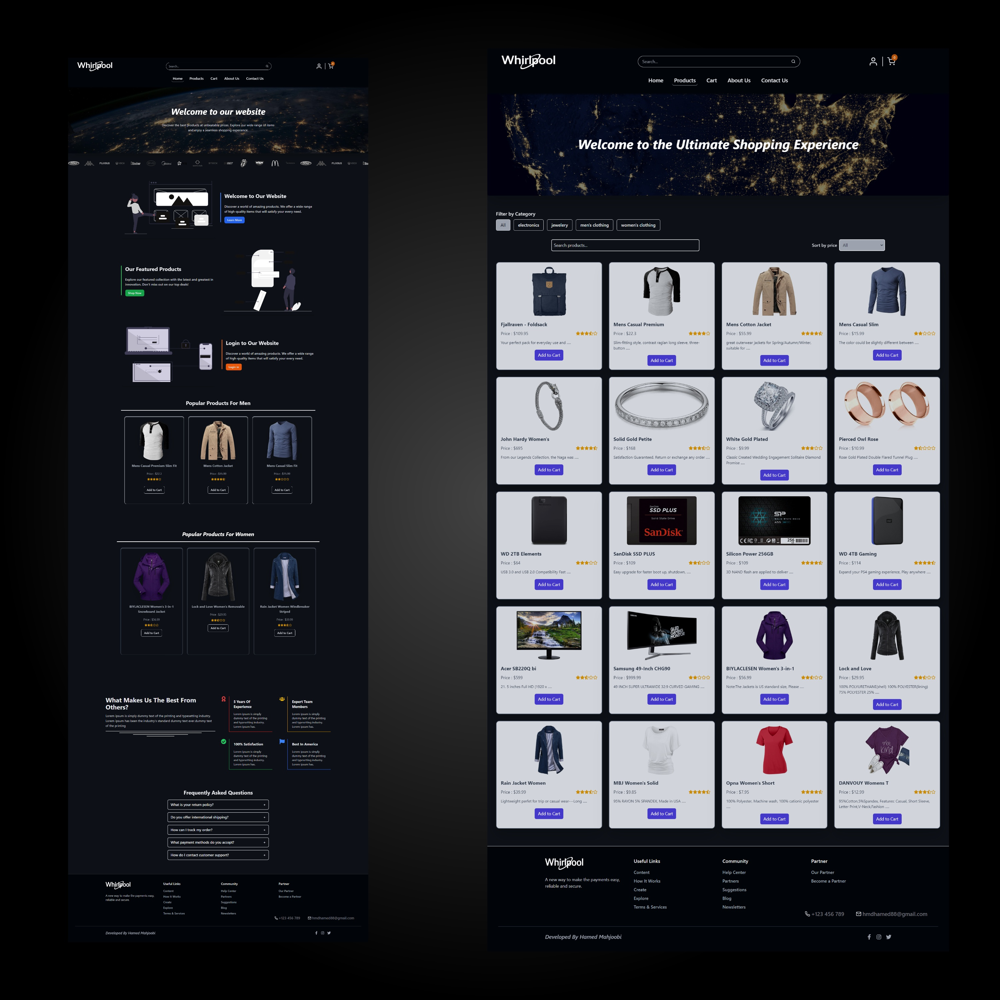
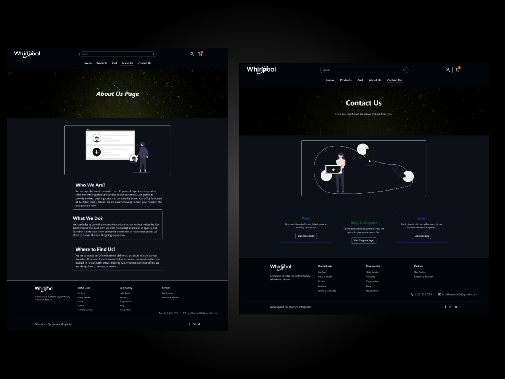

# Advanced Store Project

## Live Demo
You can check out the live demo of the project at the following link : [Shopping Cart](https://shoping-cart-advance-ruddy.vercel.app/)

## Project Overview
This is a dynamic, fully responsive Advanced Store Website built with modern technologies. The website uses the [fakeapi](https://fakestoreapi.com/) for product API integration and features a dark theme design for a sleek user interface.

## Features
Single Page Application (SPA): The project is structured as an SPA, providing a smooth and dynamic user experience.
React Query & Redux: Leveraging advanced tools like React Query and Redux to efficiently manage server state and global state throughout the application.
Product Page Features: The product page includes essential e-commerce functionalities such as:
- Product search
- Sorting options
- Product category filtering
- Dark Theme: The website comes with a modern, dark theme interface.
- Responsive Design: The project is fully responsive, ensuring optimal user experience across various devices and screen sizes.

## Technologies Used
- React.js
- Vite (for fast development and build process)
- React Query
- Redux Toolkit
- Tailwind CSS (for styling and responsiveness)
- JavaScript (ES6+)
- FakeAPI.com (for product API integration)

## Installation
### Step 1: Clone the repository:
```bash
https://github.com/hamedhmd88/Shoping-Cart-Advance
```

### Step 2: Install dependencies:
```bash
npm install
```

### Step 3: Run the application:
```bash
npm run dev
```
## Sample Screenshot
Below is a sample screenshot of the project :

 

 


